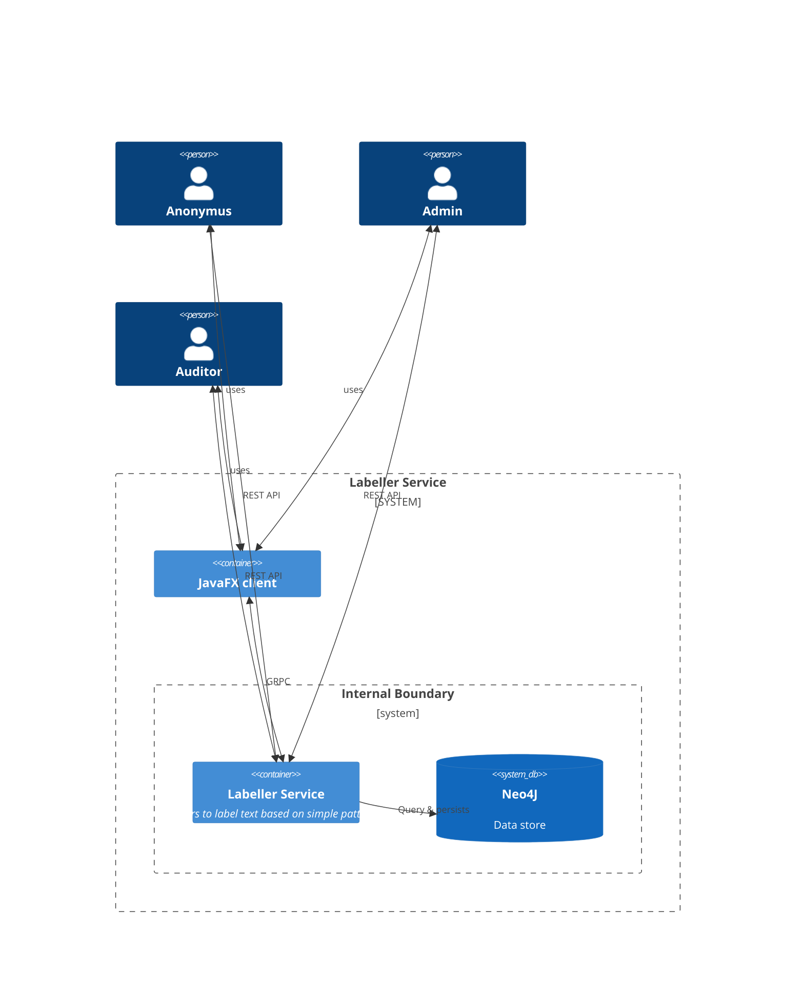

Labeller-service
====
Learning project, to experiment with stuff.

# C4 Component diagram

```mermaid
C4Container
    Person(c1, "Anonymus")
    Person(c2, "Admin")
    Person(c3, "Auditor")

    System_Boundary(b1, "Labeller Service") {
        Container(Client, "JavaFX client")

        Boundary(b2, "Internal Boundary") {    
            Container(Service, "Labeller Service", "Allows users to label text based on simple pattern search")
            SystemDb(neo4J, "Neo4J", "Data store")
        }
        
    }

    BiRel(c1, Service, "REST API")
    BiRel(c2, Service, "REST API")
    BiRel(c3, Service, "REST API")
    BiRel(Client, Service, "GRPC")
    BiRel(c1, Client, "uses")
    BiRel(c2, Client, "uses")
    BiRel(c3, Client, "uses")

    Rel(Service, neo4J, "Query & persists")
```
