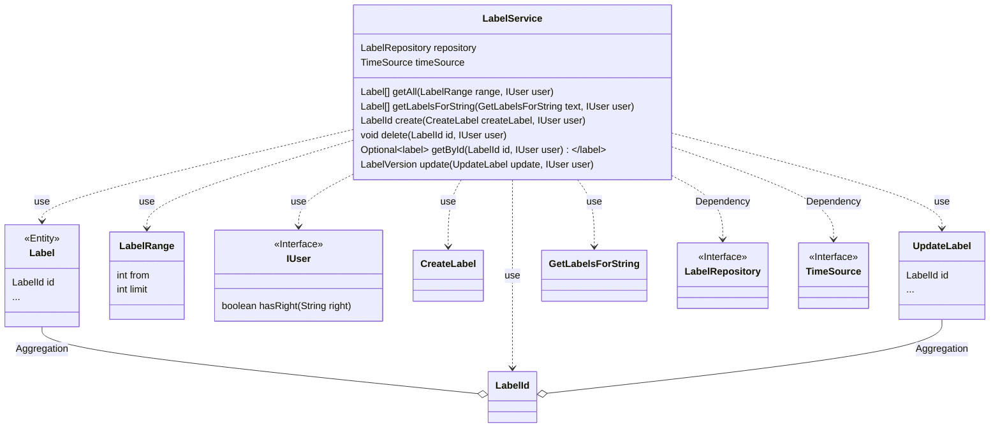
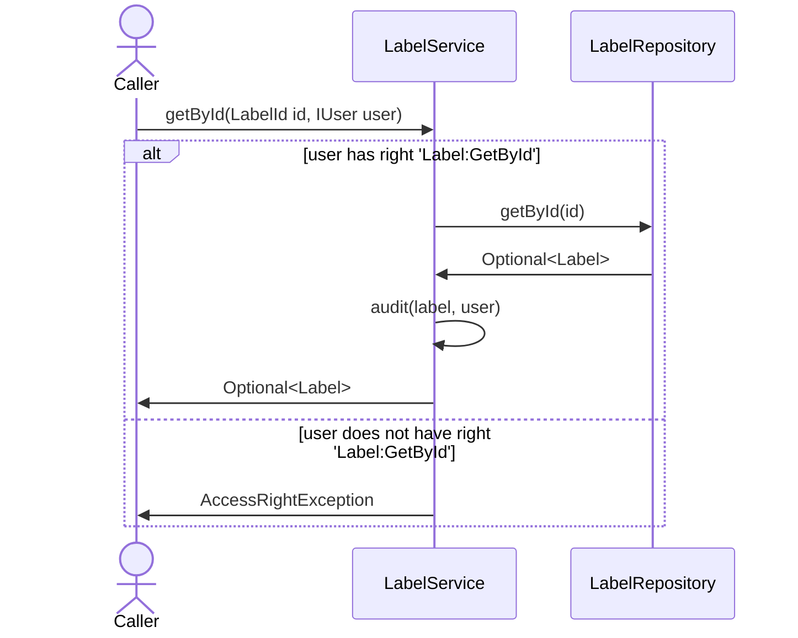
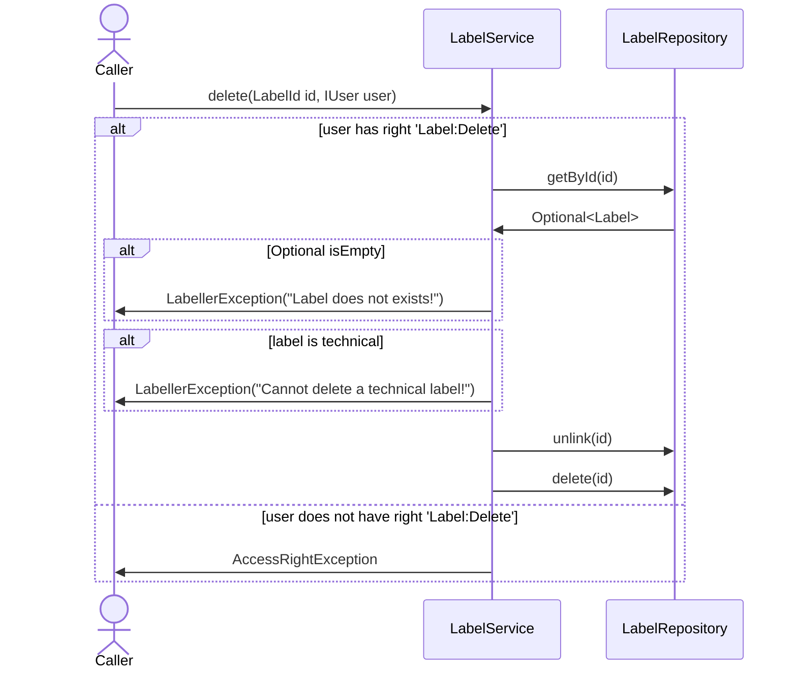

LabelService
====
The main service of the domain.  

```mermaid
classDiagram
class LabelId
class Label {
    LabelId id
    ...
}
<<Entity>> Label
class LabelRange {
    int from
    int limit
}
class IUser {
    boolean hasRight(String right)
}
<<Interface>> IUser
class CreateLabel
class UpdateLabel {
    LabelId id
    ...
}
class GetLabelsForString
class LabelRepository
<<Interface>> LabelRepository
class TimeSource
<<Interface>> TimeSource
class LabelService {
    LabelRepository repository
    TimeSource timeSource
    Label[] getAll(LabelRange range, IUser user)
    Label[] getLabelsForString(GetLabelsForString text, IUser user)
    LabelId create(CreateLabel createLabel, IUser user)
    void delete(LabelId id, IUser user)
    Optional<Label> getById(LabelId id, IUser user)
    LabelVersion update(UpdateLabel update, IUser user)
}

LabelService ..> TimeSource : Dependency
LabelService ..> LabelRepository : Dependency
LabelService ..> CreateLabel : use
LabelService ..> UpdateLabel : use
LabelService ..> GetLabelsForString : use
LabelService ..> IUser : use
LabelService ..> LabelRange : use
LabelService ..> Label : use
Label --o LabelId : Aggregation
LabelService ..> LabelId : use
UpdateLabel --o LabelId : Aggregation
```

getById(LabelId id, IUser user)
----

```mermaid
sequenceDiagram
actor Caller 
Caller ->> LabelService: getById(LabelId id, IUser user)
alt user has right 'Label:GetById'
    LabelService ->> LabelRepository: getById(id)

    LabelRepository ->> LabelService: Optional<Label>

    LabelService ->> LabelService: audit(label, user)

    LabelService ->> Caller: Optional<Label>
else user does not have right 'Label:GetById'
    LabelService ->> Caller: AccessRightException
end
```

delete(LabelId id, IUser user)
----

```mermaid
sequenceDiagram
actor Caller 
Caller ->> LabelService: delete(LabelId id, IUser user)
alt user has right 'Label:Delete'
    LabelService ->> LabelRepository: getById(id)

    LabelRepository ->> LabelService: Optional<Label>

    alt Optional isEmpty
        LabelService ->> Caller: LabellerException("Label does not exists!")
    end

    alt label is technical
        LabelService ->> Caller: LabellerException("Cannot delete a technical label!")
    end

    LabelService ->> LabelRepository: unlink(id)
    LabelService ->> LabelRepository: delete(id)
else user does not have right 'Label:Delete'
    LabelService ->> Caller: AccessRightException
end
```
